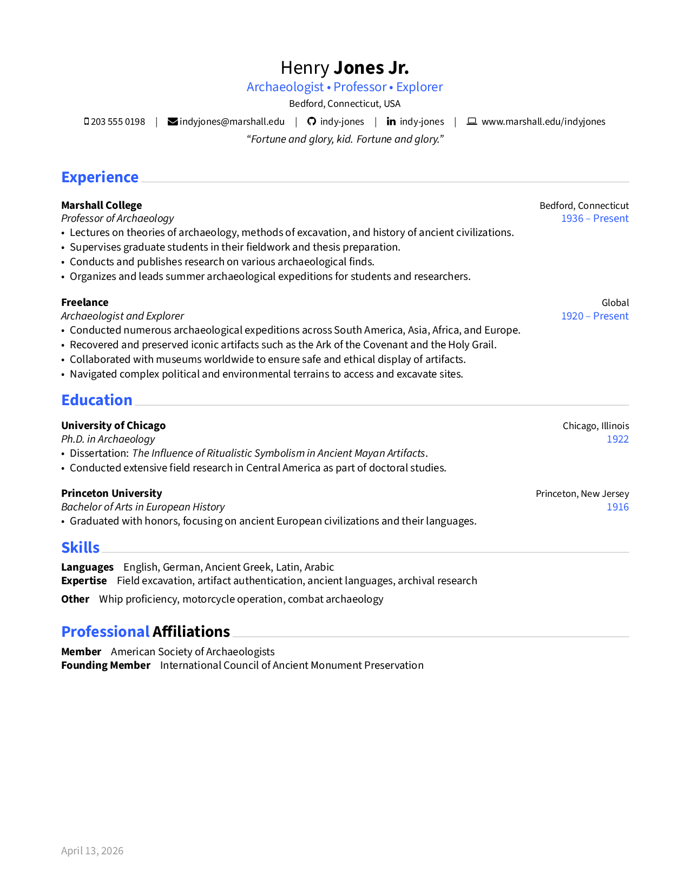
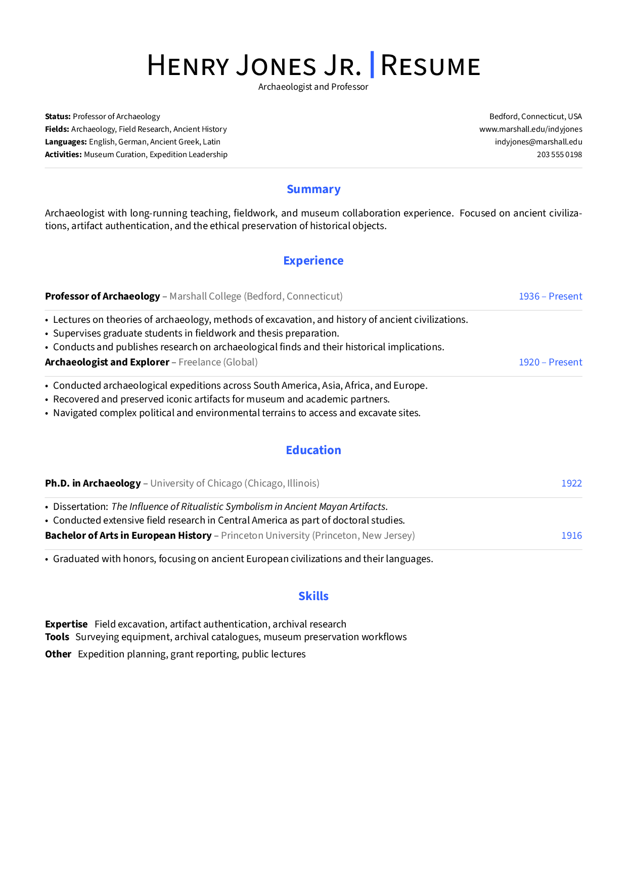

# andre-CV

A polyglot monorepo containing:

- A LaTeX document-class package for building German-style CVs, US-style resumes, modern centered resumes, and classic resumes with optional cover letters
- Rust libraries and CLI tooling for generating LaTeX from structured YAML data

## Repository Layout

```
andre-cv/
├── latex/          LaTeX classes and themes (self-contained, copy-and-use)
│   ├── andre-cv.cls
│   ├── andre-cv-base.cls
│   └── themes/
│       ├── german-cv.sty
│       ├── us-resume.sty
│       ├── awesome-resume.sty
│       └── classic-resume.sty
├── libs/
│   └── andre-cv-core/  Core Rust library (schema, parsing, validation, rendering)
├── tools/
│   └── cli/            Command-line interface
├── samples/        Reference .tex files and supporting assets
└── schema/         YAML resume schema
```

## Current Status

This project is still marked beta. The document API may change, and backward
compatibility is not guaranteed between revisions.

**Known gaps:**

- `theme=awesome-resume` — cover letter not yet implemented
- `theme=classic-resume` — cover letter not yet implemented

## Themes

<table>
<tr>
<td align="center"><b>german-cv</b><br></td>
<td align="center"><b>us-resume</b><br></td>
</tr>
<tr>
<td align="center"><b>awesome-resume</b><br></td>
<td align="center"><b>classic-resume</b><br></td>
</tr>
</table>

## LaTeX Quick Start

Copy the `latex/` directory somewhere on your `TEXINPUTS` path and use the
class directly:

```tex
\documentclass[theme=german-cv,10pt]{andre-cv}
```

or

```tex
\documentclass[theme=us-resume,10pt]{andre-cv}
```

or

```tex
\documentclass[theme=awesome-resume,10pt]{andre-cv}
```

or

```tex
\documentclass[theme=classic-resume,10pt]{andre-cv}
```

### Requirements

- `fontspec`, `luacode`, `biblatex` / `biber` (for bibliography support in samples)
- Compile with `lualatex`, not `pdflatex`

### Example — German-style CV

```tex
\documentclass[theme=german-cv,10pt]{andre-cv}

\setmainfont{Source Sans 3}
\setsansfont{Source Sans 3}
\setmonofont{Source Sans 3}

\SetName{Dr. Henry Jones, Jr.}
\SetTown{Bedford, Connecticut, USA}
\SetPhone{+1 203 555 0198}
\SetEmail{indyjones@marshall.edu}
\SetCitizenship{USA}

\begin{document}
\DisplayHeader{Archaeologist}{./img/photo.png}

\section{Experience}
\cventry[
  dates    = {1936 - Present},
  title    = {Professor of Archaeology},
  org      = {Marshall College},
  location = {Bedford, Connecticut, USA},
]{\cvitemize{
  \item Example bullet
}}
\end{document}
```

### Example — US-style resume

```tex
\documentclass[theme=us-resume,10pt]{andre-cv}

\setmainfont{Source Sans 3}
\setsansfont{Source Sans 3}
\setmonofont{Source Sans 3}

\SetName{Dr. Henry Jones, Jr.}
\SetTown{Bedford, Connecticut}
\SetPhone{203 555 0198}
\SetEmail{indyjones@marshall.edu}

\MakeHeader
  {\DisplayName}
  {\DisplayTown}
  {\DisplayEmail~$\cdot$~\DisplayPhone}

\begin{document}
\section{Experience}
\cventry[
  dates    = {1936 - Present},
  title    = {Professor of Archaeology},
  org      = {Marshall College},
  location = {Bedford, Connecticut},
]{\cvitemize{
  \item Example bullet
}}
\end{document}
```

### Building the Samples

The classes live in `latex/`, so set `TEXINPUTS` when calling lualatex.
Compile from `samples/` so that relative image paths resolve correctly:

```bash
cd samples
TEXINPUTS=../latex//: lualatex german-cv.tex
biber german-cv
TEXINPUTS=../latex//: lualatex german-cv.tex
TEXINPUTS=../latex//: lualatex german-cv.tex
```

```bash
cd samples
TEXINPUTS=../latex//: lualatex us-resume.tex
biber us-resume
TEXINPUTS=../latex//: lualatex us-resume.tex
TEXINPUTS=../latex//: lualatex us-resume.tex
```

```bash
cd samples
TEXINPUTS=../latex//: lualatex awesome-resume.tex
```

```bash
cd samples
TEXINPUTS=../latex//: lualatex classic-resume.tex
```

If you are not using `biblatex`, skip the `biber` step.

### Class Options

The unified class accepts:

- `theme=us-resume`, `theme=german-cv`, `theme=awesome-resume`, or `theme=classic-resume`
- `10pt`, `11pt`, `12pt`
- `a4paper`, `letterpaper`
- `english`, `german`

Theme defaults:

- `theme=german-cv` defaults to `a4paper`
- `theme=us-resume` defaults to `letterpaper`
- `theme=awesome-resume` defaults to `letterpaper`
- `theme=classic-resume` defaults to `a4paper`

Paper and language can still be overridden explicitly:

```tex
\documentclass[theme=german-cv,10pt,letterpaper,german]{andre-cv}
```

### Document API

#### Shared personal-detail commands

- `\SetName{...}`
- `\SetAddressOne{...}`, `\SetAddressTwo{...}`, `\SetAddressThree{...}`
- `\SetTown{...}`
- `\SetPhone{...}`
- `\SetEmail{...}`
- `\SetCitizenship{...}`
- `\SetGithub{...}`
- `\SetLinkedIn{...}`
- `\SetXing{...}`
- `\SetHomepage{...}`

`SetTown`, `SetPhone`, `SetEmail`, `SetCitizenship`, `SetGithub`,
`SetLinkedIn`, `SetXing`, and `SetHomepage` are rendered in a deterministic
category order in the German CV header.

For `\SetHomepage`, pass a bare host/path such as `www.example.com`; the
class prepends `https://`.

#### Theming

- `\SetAccentColor{ColorName}` overrides the accent color.

Built-in color names: `UltramarineBlue`, `YellowGreen`, `Fuchsia`,
`Tangerine`, `ElectricViolet`, `Coquelicot`, `Rose`.

#### Shared section and content commands

- `\section{Title}`
- `\cvitemize{ ... }`
- `\cvitem{label}{value}`
- `\cventry[dates=..., title=..., org=..., location=..., url=...]{...}`
- `coverletter` environment

If `url` is provided, the entry title is rendered as a hyperlink.

#### Theme-specific commands

`theme=german-cv`:

- `\DisplayHeader{subtitle}{image-path}`
- `\DisplaySignature{signature-image-path}{location}`
- `\ResizeTabular{width}`
- `\HeaderImageSizeCm{number}`

`theme=us-resume`:

- `\MakeHeader{line1}{line2}{line3}`
- `\SetBadge{scale}{image-path}`

`theme=awesome-resume`:

- `\DisplayModernHeader{roles}{quote}` — renders the header block inline at the top of the document body. `roles` is a string of role labels (e.g., `Engineer \textbullet\ Architect`); `quote` is a short italic tagline. Contact details are auto-assembled from `\SetPhone`, `\SetEmail`, `\SetGithub`, etc.

`theme=classic-resume`:

- `\DisplayClassicHeader{document-label}{subtitle}`
- `\ClassicMeta{right}{left}`
- `\ClassicMetaRule`

#### Deprecated commands

- `\cventrylegacy`, `\cvlistitem`
- `\cvpadlessentry` (german-cv only)

## Acknowledgements

- `theme=classic-resume` — layout inspired by [Jan Küster's latexcv](https://github.com/jankapunkt/latexcv)
- `theme=awesome-resume` — layout inspired by [posquit0's Awesome-CV](https://github.com/posquit0/Awesome-CV)

## Licenses

This repository uses two licenses depending on the component:

| Component | License | File |
|-----------|---------|------|
| `latex/` — LaTeX classes and themes | LaTeX Project Public License 1.3c | `latex/LICENSE.txt` |
| `libs/`, `tools/` — Rust source code | Apache License 2.0 | `LICENSE.txt` |

The LaTeX classes (`latex/`) are distributed under the LPPL 1.3c because that
is the standard license for LaTeX packages and is expected by CTAN. The LPPL
requires that the files constituting the Work are listed; see
`latex/manifest.txt`.

The Rust libraries and CLI (`libs/`, `tools/`) are distributed under the
Apache License 2.0, which is the conventional open-source license for Rust
crates and provides an explicit patent grant.

The sample files in `samples/` are part of the LaTeX Work and are covered by
the LPPL 1.3c.
